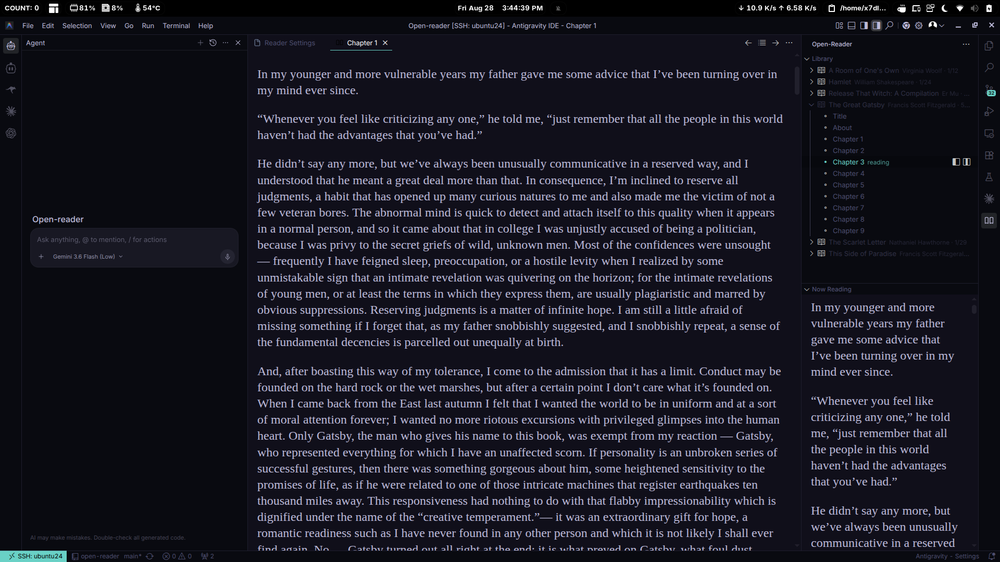
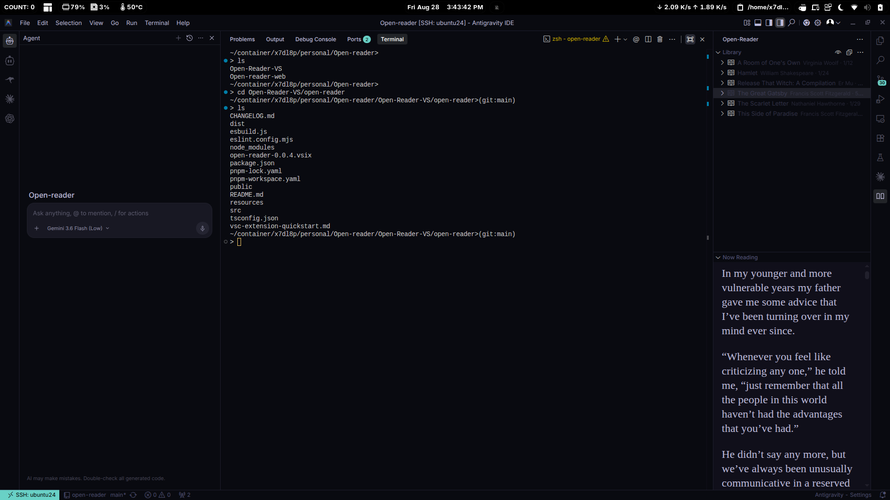
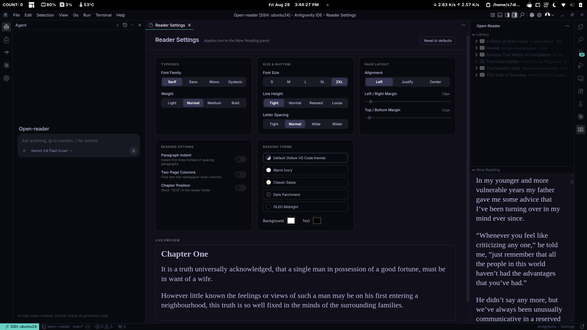

# Open Reader

**Read EPUB books and CBZ comics inside VS Code** — in the sidebar while you work, or full-width in the editor area. No browser, no external service, no data leaving your machine.

The web version reads more: **EPUB · CBZ · Markdown · HTML · plain text**.

Also available on the web: **[epub-web-reader.vercel.app](https://epub-web-reader.vercel.app/)**

---

## Reading where you work

Books live in the sidebar next to your code. Open a chapter in the editor area for a full-width read, or keep it in the Reader panel below the library — both are styled prose, never your editor's code font.



## The sidebar keeps your place

The Reader panel sits under the library, so a book stays open next to a terminal, a diff, or the Source Control view. Switch away and back — **your scroll position is exactly where you left it**, per chapter.



## Tune it once, applied live

Typeface, size, rhythm, margins, and reading theme — every change lands in the reader as you make it, with a live preview on the settings page itself.



---

## Features

- **Library view** — every `.epub` and `.cbz` in your library folders, expandable to chapters (or comic pages), with per-book reading progress.
- **File browsing** — the eye button in the view title swaps the book list for the library folder as it sits on disk; books open in the reader, everything else opens as a normal editor tab.
- **Two reading surfaces** — the Reader panel in the sidebar, or a full-width editor tab. Both honour the same typography settings, picked per chapter from the hover icons.
- **Resume where you left off** — reading progress per book, and scroll position per chapter, both remembered across restarts.
- **Reader Settings** — font family/size/weight, line height, letter spacing, alignment, margins, paragraph indent, two-page columns, and reading themes (Warm Ivory, Classic Sepia, Dark Parchment, OLED Midnight, or your own colours).
- **Local and private** — books are parsed on demand and cached in memory; embedded images are extracted to extension storage rather than inlined. Nothing is uploaded.

## Install

```
code --install-extension open-reader-0.0.5.vsix
```

Then open the **Open Reader** view in the activity bar. By default it scans your workspace folder for books — use **Add Folder** in the view's `···` menu to point it somewhere else.

## Settings

All under `openReader.*`, editable from the Reader Settings page or `settings.json`:

| Setting | What it does |
| --- | --- |
| `libraryFolders` | Folders to scan for books. Empty = the current workspace folder(s). |
| `fontFamily`, `fontSize`, `fontWeight` | Serif / sans / mono / dyslexic, five sizes, four weights. |
| `lineHeight`, `letterSpacing`, `textAlign` | Reading rhythm and alignment. |
| `marginX`, `marginY` | Padding around the text, in pixels. |
| `indent` | Indent first lines instead of spacing paragraphs apart. |
| `twoPageMode` | Newspaper-style columns instead of one flowing column. |
| `showChapterNumbers` | Show `3/24` in the reader footer. |
| `bgColor`, `textColor` | Custom reading theme. Empty follows your VS Code theme. |

## Formats

EPUB and CBZ today. The format layer (`src/epub/formats.ts`) is a small registry, so new formats plug in without touching the rest of the extension.

**Known limitation:** tables and complex EPUB layouts are flattened to plain HTML.

## Links

- Developer — [github.com/x7dl8p](https://github.com/x7dl8p)
- Web reader — [epub-web-reader.vercel.app](https://epub-web-reader.vercel.app/)

## Release Notes

### 0.0.5

New icon, and a rewritten README with screenshots.

### 0.0.4

About page in the view's `···` menu.

### 0.0.3

Scroll position remembered per chapter; the eye button browses library files, with non-book files opening as normal editor tabs; shorter menu names; the Now Reading panel is now **Reader**.

### 0.0.2

The editor-area reader became a styled surface that follows the reader settings, instead of a plain text document. Chapter hover icons now name their destination.

### 0.0.1

Initial release.
